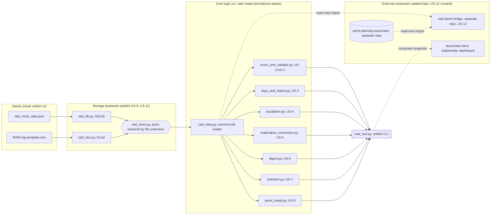
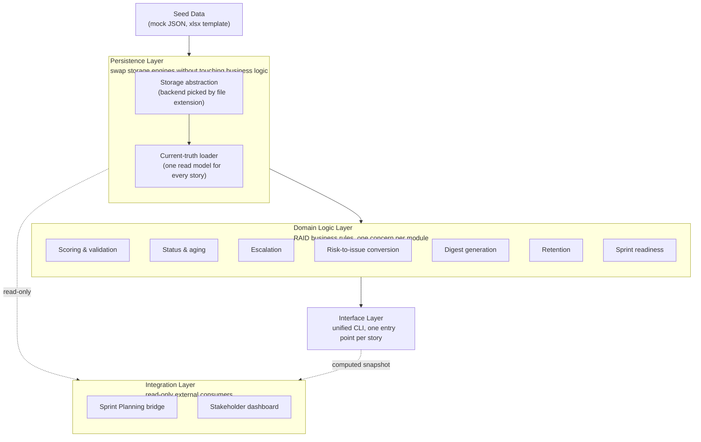

# Architecture Overview (as built)

This describes the current end state of the RAID Log Automator system — not
the original plan. The shape of this system changed twice during
implementation, each time in response to something discovered while
building rather than decided up front. See `raid-log-automator-PRD.md`
Sections 13–15 for the full scoping detail behind each change.

1. **v1 (US-1–US-8)** was simple by design: every story module loaded
   `raid_mock_data.json` directly and computed everything fresh, in memory,
   every run. No persistence existed — there was nothing to architect
   beyond "read JSON, compute, print."
2. **US-9/US-10** introduced real persistence (`raid_db.py`, SQLite) and,
   with it, the first shared abstraction: `raid_data.py` became the
   "current truth" loader every read-only story composes on, since state
   now had to survive between separate runs, not just within one.
3. **US-11 forced a real refactor, not just an addition.** Adding the xlsx
   backend meant every module that talked to `raid_db.py` directly had to
   be rewired to talk to a new facade, `raid_store.py`, instead — otherwise
   xlsx support would have meant a second, parallel copy of every story's
   persistence logic. This is the one point where "add a feature" became
   "change the architecture."
4. **US-12 and the dashboard introduced external consumers for the first
   time.** `raid-sprint-bridge` is a separate repo that imports this
   project's own `raid_data`/`raid_store` modules read-only (the one piece
   explicitly allowed to depend on this project, per PRD Section 15.3)
   alongside Sprint Planning Automator's own loaders. `docs/index.html` is
   a downstream, currently-static snapshot of the computed data (not yet
   regenerated by a script — an honest limitation noted in the README).

## Diagram

## Logical View

The diagram above shows *which files import which* — useful for tracing a
change, but it flattens five different responsibilities into one graph.
This view groups the same system by logical layer instead, to show *why*
the pieces are separated the way they are.

**Why this grouping, not the file grouping:**

- **Persistence Layer** exists to answer one question — "what does the log
  currently say?" — the same way regardless of whether the answer comes
  from SQLite or xlsx. Everything above this line is backend-agnostic; the
  backend choice is fully absorbed before `raid_data.py` hands data
  upward.
- **Domain Logic Layer** is flat and siloed on purpose — each module owns
  one RAID concern and depends only on the persistence layer, never on a
  sibling module. That's what let US-11's storage refactor touch the
  persistence layer alone without rippling into all seven story modules.
- **Interface Layer** is a thin composition point, not a place where logic
  lives — it exists so every domain module stays independently runnable
  (its own `main()`) while still being callable from one CLI.
- **Integration Layer** sits outside the trust boundary of this repo: it
  reads through the persistence layer or the CLI's output, never reaches
  into domain logic directly, and nothing in this repo depends back on it.

## Notes on reading the diagram

- **Seeds are read-only everywhere.** Neither `raid_mock_data.json` nor
  `RAID-log-template.xlsx` is ever written to by any module — they exist
  only to seed a working store (`raid_log.db` or an `.xlsx` working copy)
  on first use.
- **`raid_store.py` is a pure dispatch facade** — it has no logic of its
  own beyond picking `raid_db.py` vs `raid_xlsx.py` by the target path's
  file extension. Every story module above it is backend-agnostic by
  construction, not by convention.
- **Every standalone module keeps its own `main()`** as an independent
  entry point, per the PRD's Section 4 standalone-runnability principle.
  `raid_tool.py` calls the same underlying functions directly rather than
  shelling out to those `main()`s, so both paths stay in sync by
  construction — there's no second implementation to drift.
- **`raid-sprint-bridge` is the one piece allowed to depend on this
  project.** Neither this repo nor Sprint Planning Automator imports or
  depends on the bridge; the dependency arrow only ever points inward,
  from the bridge to the two projects it connects.
